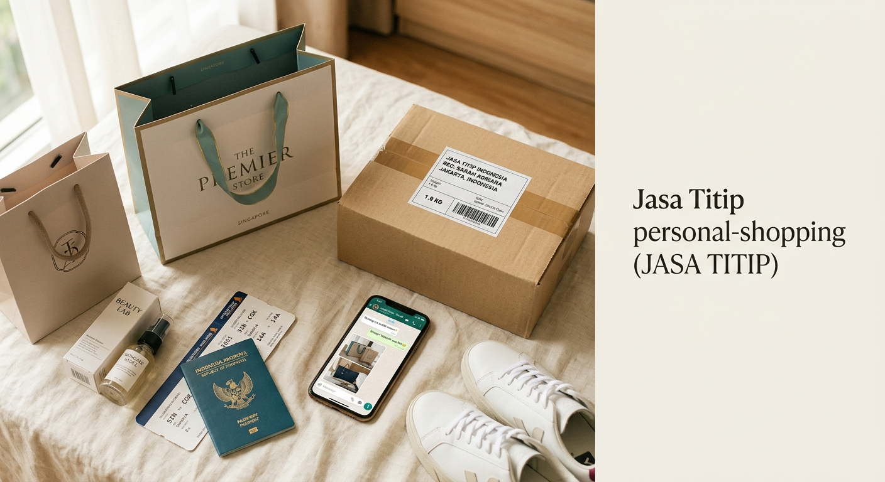

# Jastipin

Landing page untuk layanan **jasa titip (jastip)** belanja, dibuat sebagai situs statis ringan tanpa proses build. Konsep, copy, dan desain dibangun berdasarkan riset model bisnis jastip di Indonesia: pembeli menitipkan barang yang sulit didapat (skincare, fashion, gadget, snack impor) kepada personal shopper, lalu membayar harga barang ditambah biaya titip dan ongkir.

**Live:** [https://jastip-in.web.id](https://jastip-in.web.id)



## Kenapa situs ini ada

Bisnis jastip sepenuhnya bergantung pada **kepercayaan**: pelanggan membayar di muka untuk barang yang belum mereka pegang. Karena itu seluruh halaman dirancang untuk menurunkan keraguan calon pelanggan:

- Harga transparan di awal (harga barang, biaya titip, ongkir).
- Bukti di setiap tahap (foto struk, foto barang, foto paket).
- Proses empat langkah yang mudah dipahami.
- Testimoni dan angka kepercayaan.
- FAQ yang menjawab keberatan paling umum.

## Fitur

- Halaman statis murni (HTML, CSS, JavaScript vanilla), tanpa framework dan tanpa build step.
- Responsif penuh dari mobile (390px) hingga desktop.
- Animasi scroll-reveal hemat yang menghormati `prefers-reduced-motion`.
- Menu mobile, navigasi sticky, dan accordion FAQ tanpa dependensi.
- Aksesibilitas WCAG AA: skip link, kontras tombol 5.34:1, heading sequential, atribut alt, label ARIA.
- Gambar produk disimpan lokal di `assets/`.
- Security headers via `vercel.json` (CSP, X-Content-Type-Options, X-Frame-Options, dst.).
- SEO lengkap: Open Graph, Twitter Card, JSON-LD LocalBusiness schema, `robots.txt`, `sitemap.xml`.

## Kontak & Operasional

| Item | Nilai |
|------|-------|
| WhatsApp | `628118696940` |
| Email | `halo@jastipin.id` |
| Jam operasional | Senin – Minggu, 09.00 – 22.00 WIB |
| Metode pembayaran | Transfer BCA, GoPay, OVO, DANA, ShopeePay |

## Analytics & Tracking

| Tools | ID | Keterangan |
|-------|----|------------|
| Google Analytics 4 | `G-PH1XJC9W3B` | Event & konversi |
| Google Tag Manager | `GTM-WQ3THMWQ` | Container tag terpusat |
| Vercel Web Analytics | Auto | Page views & Web Vitals |

## SEO

- `sitemap.xml` tersedia di: `https://jastip-in.web.id/sitemap.xml`
- `robots.txt` tersedia di: `https://jastip-in.web.id/robots.txt`
- Tag `<link rel="canonical">` mengarah ke `https://jastip-in.web.id/`
- Open Graph & Twitter Card tags tersedia di `<head>`
- JSON-LD `LocalBusiness` schema di `<body>` sebelum `</body>`
- Daftarkan sitemap ke [Google Search Console](https://search.google.com/search-console)

## Struktur proyek

```
jastip-claude/
├── index.html              # Markup + semua tag tracking (GA, GTM, Vercel)
├── styles.css              # Design system + seluruh styling
├── app.js                  # Nav, menu mobile, scroll-reveal
├── sitemap.xml             # Sitemap untuk SEO
├── robots.txt              # Robots direktif + pointer ke sitemap
├── vercel.json             # Security headers (CSP, X-Content-Type, dll.)
├── callback.html           # Redirect OAuth Google (untuk app mobile)
├── favicon.svg             # Favicon branded
├── assets/                 # Gambar produk lokal
│   ├── hero.jpg
│   ├── beauty.jpg
│   ├── fashion.jpg
│   ├── gadget.jpg
│   └── snacks.jpg
├── README.md
├── AGENTS.md
├── CLAUDE.md
└── .kiro/steering/
    ├── product.md
    ├── tech.md
    └── structure.md
```

## Menjalankan secara lokal

```bash
python3 -m http.server 8000
# buka http://localhost:8000
```

## Deploy

Deploy otomatis ke Vercel dari branch `main`. Domain kustom: `jastip-in.web.id`.

## Yang perlu kamu ganti

| Lokasi | Nilai saat ini | Status |
|--------|----------------|--------|
| Statistik hero | 38 negara, 52.000+ pesanan, 14.000+ pelanggan, 4,9/5 | Ganti dengan angka asli |
| Testimoni | Rani, Dimas, Carissa | Ganti dengan testimoni pelanggan asli |
| `sitemap.xml` → `<lastmod>` | `2026-06-24` | Update saat ada perubahan konten besar |
| Eyebrow hero | "sejak 2019" | Sesuaikan tahun berdiri |

## Desain

| Token | Nilai |
|-------|-------|
| Warna utama | Teal hijau `#0f5c4a` |
| Aksen CTA | Oranye hangat `#e8762f` (teks gelap `#1b2420`, contrast 5.34:1) |
| Latar | Krem `#faf6ee` |
| Tipografi | Plus Jakarta Sans |
| Radius | 16px (kartu), pill (tombol) |

## Lisensi

Bebas dipakai dan dimodifikasi untuk kebutuhan bisnis jastip kamu.
